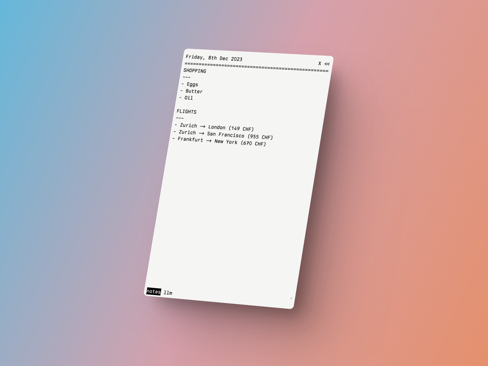
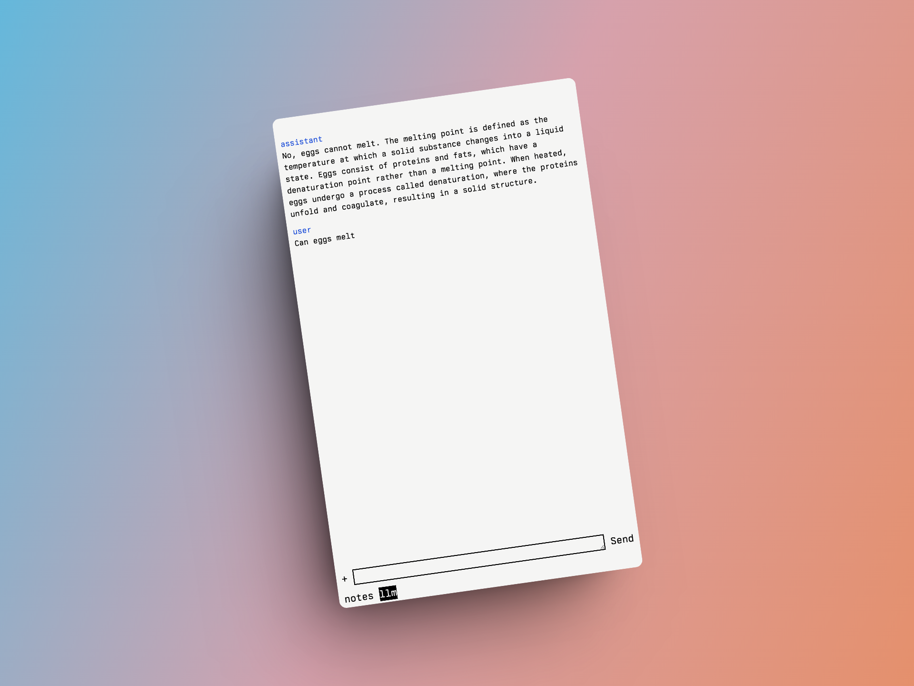

# Notes and LLM App - using Bun.js/Elysia and HTMX

## features

- a scratchpad for notes that synchronizes in realtime across devices using server-sent events (SSE)
- an LLM client for GPT-4 turbo that uses websockets to stream responses




## Technologies

- [Elysia](elysiajs.com) - a web framework for
- [Bun](bun.sh) - a fast JS/TS runtime
- [HTMX](htmx.org) - a JS library for making HTML interactive
- [Turso](turso.tech) - a fast, distributed SQLite database

## ENV variables

```
LIBSQL_URL // Database connection url
LIBSQL_TOKEN // Database connection token
PASSWORD // Password for the app
OPENAI_KEY // OpenAI API key
AUTH_TOKEN // Auth token, gets set in cookies for authorization
```

## Local development

Install dependencies:

```bash
bun install
```

Run the app on `localhost:3000`:

```bash
bun run dev
```

## Deploying to production

You can deploy the app as a Docker container using the included Dockerfile on any service. Don't forget to set the environment variables.
